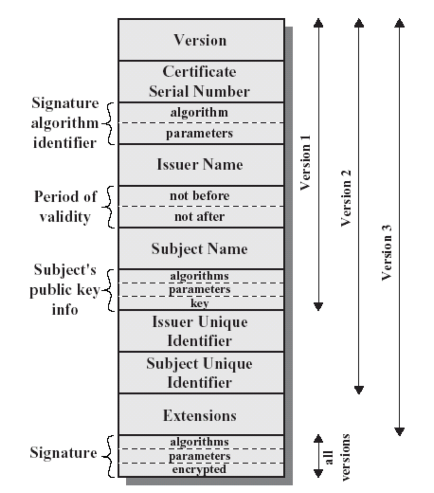

# CIPHER-ALGORITHM

## 一、近代密码阶段

近代密码是指从第一次世界大战、第二次世界大战到 1976 年这段时期密码的发展阶段。

电报的出现第一次使远距离快速传递信息成为可能,事实上,它增强了西方各国的通讯能力;20 世纪初,意大利物理学家奎里亚摩•马可尼发明了无线电报,让无线电波成为新的通讯手段,它实现了远距离通讯的即时传输,但是通过无线电波送出的每条信息不仅传给了己方,也传送给了敌方,因此这就意味着必须给每条信息加密,随着第一次世界大战的爆发,对密码和解码人员的需求急剧上升,一场秘密通讯的全球战役打响了。

公元 20 世纪初,第一次世界大战进行到关键时刻,英国破译密码的专门机构“40号房间”利用缴获的德国密码本破译了著名的“齐默尔曼电报”,促使美国放弃中立参战,改变了战争进程。

随着计算机科学的发展,快速电子计算机和现代数学方法一方面为加密技术提供了新的方法、新的概念和新的工具,另一方面也为破译者提供了有力的武器。计算机和电子时代的到来给密码设计者们带来了前所未有的自由,他们可以轻松地减少原先用铅笔和纸在做手工设计时易犯的错误,也不用再担心使用电子机械方式实现密码机的高额费用。总之,利用电子和计算机技术可以设计出更加复杂的密码体系。

Enigma(隐匿之王):ArthurScherbius 于 1919 在德国问世,它的设计结合了机械系统与电子系统。它被证明是有史以来最为可靠的加密系统之一,从而使得二战期间德军的保密通讯技术处于当时的领先地位。

1943 年,美国从破译的日本电报中得知山本五十六将于 4 月 18 日乘中型轰炸机, 由 6 架战斗机护航,到中途岛视察时,美国总统罗斯福亲自做出决定截击山本,山本乘坐的飞机在去往中途岛的路上被美军击毁,山本机毁人亡,日本海军从此一蹶不振。密码学的发展直接影响了二战的战局。

在二次世界大战中,印第安纳瓦霍土著语言被美军用作密码,美国二战时候特别征摹使用印第安纳瓦霍通信兵。在二次世界大战日美的太平洋战场上,美国海军军部让北墨西哥和亚历桑那印第安纳瓦霍族人使用纳瓦霍语进行情报传递。纳瓦霍语的语法、音调及词汇都极为独特,不为世人所知道,当时纳瓦霍族以外的美国人中,能听懂这种语言的也就一二十人。这是密码学和语言学的成功结合,纳瓦霍语密码成为历史上从未被破译的密码。

有人说密码学至少使二战的时间缩短了一年。

随着 Enigma 的破译,人们意识到其实真正保证密码安全的往往不是算法,而是密钥。即使算法外泄,但只要密钥保密,密码就不会失效。

荷兰密码学家 Kerckhoffs 于 1883 年在其名著作《军事密码学》中提出密码学的基本假设:密码系统中的算法即使为密码分析者所知,对推导出明文或密钥也没有帮助。也就是说,密码系统的安全性应只取决于可随时改变的密钥,而不应取决于不易被改变的事物(算法)。

## 二、现代密码阶段

现代密码学的发展与计算机技术、电子通信技术密切相关。在这一阶段,密码理论得到了蓬勃发展,密码算法的设计与分析互相促进,从而出现了大量的加密算法和各种分析方法。除此之外,密码的使用扩张到各个领域,而且出现了许多通用的加密标准,从而促进了网络和技术的发展。

### (一)序列密码

#### 1.欧洲的序列密码

2004 年,欧洲启动了为期四年的ECRYPT(EuropeanNetworkofExcellenceforCryptology)计划,其中的序列密码项目称为 eSTREAM,主要任务是征集新的可以广泛使用的序列密码算法,以改变NESSIE(NewEuropeanSchemesforSignatures,Integnity,andEncryption)工程 6 个参赛序列密码算法完全落选的状况。该工程于 2004 年 11 月开始征集算法,共收集到了 34 个候选算法。经过 3 轮为期 4 年的评估,2008 年 eSTREAM 项目结束,最终有 7 个算法胜出。

eSTREAM 项目丰富了序列密码研究的数据库,极大地促进了序列密码的研究。虽然 eSTREAM 计划的评选工作已结束,但是其中的好多获选序列密码算法非常值得进一步的深入分析研究。另外,没有最终获选的一些密码体制也都具有各自独特的优点,其设计思想有借鉴意义,因此同样值得我们继续分析和研究。

#### 2.中国的 ZUC 算法

ZUC 算法,又称祖冲之算法,是 3GPP(3rdGenerationPartnershipProject)机密性算法 EEA3 和完整性算法 EIA3 的核心,是由中国自主设计的加密算法。2009 年 5 月 ZUC算法获得 3GPP 安全算法组 SA 立项,正式申请参加 3GPPLTE 第三套机密性和完整性算法标准的竞选工作。历时两年多的时间,ZUC 算法经过包括 3GPPSAGE 内部评估,两个邀请付费的学术团体的外部评估以及公开评估等在内的 3 个阶段的安全评估工作后,于 2011年 9 月正式被 3GPPSA 全会通过,成为 3GPPLTE 第三套加密标准核心算法。

ZUC 算法是中国第一个成为国际密码标准的密码算法。其标准化的成功,是中国在商用密码算法领域取得的一次重大突破,体现了中国商用密码应用的开放性和商用密码设计的高能力,其必将增大中国在国际通信安全应用领域的影响力,且今后无论是对中国在国际商用密码标准化方面的工作还是商用密码的密码设计来说都具有深远的影响。

### (二)摘要算法（HASH 函数）

#### 1.MD4

MD4 是麻省理工学院教授 RonaldRivest 于 1990 年设计的一种信息摘要算法。它是一种用来测试信息完整性的密码散列函数。其摘要长度为 128 位,一般 128 位长的MD4 散列被表示为 32 位的十六进制数字。这个算法影响了后来的算法如 MD5、SHA 家族和 RIPEMD 等。

2004 年 8 月,山东大学教授王小云报告在计算 MD4 时可能发生杂凑冲撞,同时公布了对 MD5、HAVAL-128、MD4 和 RIPEMD 四个著名 HASH 算法的破译结果。

Denboer 和 Bosselaers 以及其他人很快地发现了攻击 MD4 版本中第一步和第三步的漏洞。Dobbertin 向大家演示了如何利用一部普通的个人电脑在几分钟内找到 MD4完整版本中的冲突(这个冲突实际上是一种漏洞,它将导致对不同的内容进行加密却可能得到相同的加密后结果)。毫无疑问,MD4 就此被淘汰掉了。

尽管 MD4 算法在安全上有个这么大的漏洞,但它对在其后才被开发出来的好几种摘要算法的出现却有着不可忽视的引导作用。

#### 2.MD5

MD5 的全称是 Message-DigestAlgorithm5(信息—摘要算法),在 20 世纪 90 年代初由 MITLaboratoryforComputerScience 和 RSADataSecurityIn 的 RonaldLRivest 开发出来,经 MD2、MD3 和 MD4 发展而来。它的作用是让大容量信息在用数字签名软件签署私人密匙前被“压缩”成一种保密的格式(就是把一个任意长度的字节串变换成一定长的大整数)。

对任意少于 2 的 64 次方比特长度的信息输入,MD5 都将产生一个长度为 128 比特的输出。这一输出可以被看作是原输入报文的“报文摘要值”。MD5 以 512 位分组来处理输入的信息,且每一分组又被划分为 16 个 32 位子分组,经过了一系列的处理后,算法的输出由四个 32 位分组组成,将这四个 32 位分组级联后将生成一个 128 位散列值。

### (三)分组密码（对称算法）

* 特点
  - 加密速度快, 可以加密大文件
  - 密文可逆, 一旦密钥文件泄漏, 就会导致数据暴露
  - 加密后编码表找不到对应字符, 出现乱码
  - 一般结合Base64使用
    
* 弊端
  - 秘钥分发困难
  - 用户数目增多，密钥管理困难
  - 安全性问题(容易泄漏)
  - 可以通过非对称加密完成秘钥的分发
    > https  
      Alice 和 Bob通信, Alice给bob发送数据, 使用对称加密的方式  
      1. 生成一个非对称的秘钥对, bob生成  
      2. bob将公钥发送给alice  
      3. alice生成一个用于对称加密的秘钥  
      4. alice使用bob的公钥就对称加密的秘钥进行加密, 并且发送给bob  
      5. bob使用私钥就数据解密, 得到对称加密的秘钥  
      6. 通信的双方使用写好的秘钥进行对称加密数据加密  
      

#### 1.DES 算法

DES 算法,即美国数据加密标准算法,是 1972 年美国 IBM 公司研制的对称密码体制加密算法。明文按 64 位进行分组,密钥长度为 64 位,密钥事实上是 56 位参与 DES 运算。

DES 在最初预期作为一个标准只能使用 10-15 年,然而,出于种种原因,可能是 DES 还没有受到严重的威胁,使得 DES 的寿命要比预期长得多。在其被采用后,大约每隔 5 年被评审一次。DES 的最后一次评审是在 1999 年 1 月。但是,随着计算机计算能力的提高,DES 密钥过短的问题成为了 DES 算法安全的隐患。例如:1999 年 1 月,RSA 数据安全公司宣布:该公司所发起的对 56 位 DES 的攻击已经由一个称为电子边境基金(EFF)的组织,通过互联网上的 100000 台计算机合作在 22 小时 15 分钟内完成。

在这种情况下,对于替代 DES 的要求日益增多。最终,NIST 于 1997 年发布公告,征集新的数据加密标准作为联邦信息处理标准以代替 DES。新的数据加密标准称为AES。

尽管如此,DES 的出现是现代密码学历史上非常重要的事件。它对于我们分析掌握分组密码的基本理论与设计原理仍然具有重要的意义。

#### 2.AES 算法

密码学中的高级加密标准(AdvancedEncryptionStandard,AES),又称 Rijndael 加密算法,是美国联邦政府采用的一种区块加密标准。这个标准用来替代原先的 DES,已经被多方分析且广为全世界所使用。经过五年的甄选流程,高级加密标准由美国国家标准与技术研究院(NIST)于 2001 年 11 月 26 日发布于 FIPSPUB197,并在 2002 年 5 月 26 日成为有效的标准。2006 年,高级加密标准已然成为对称密钥加密中最流行的算法之一。AES 有一个固定的 128 位的块大小和 128,192 或 256 位大小的密钥大小。

该算法为比利时密码学家 JoanDaemen 和 VincentRijmen 所设计,结合两位作者的名字,以 Rijndael 命名之。AES 在软件及硬件上都能快速地加解密,相对来说较易于操作,且只需要很少的存储空间。作为一个新的加密标准,目前正被部署应用到更广大的范围。

#### 3.国际数据加密算法 IDEA

国际数据加密算法 IDEA(InternationalDataEncryptionAlgorithm)是由来学嘉(LaiXuejia)和 JamesMasseey 于 1990 年提出第一版,并命名为PES(ProposedEncryptionStandard)。在 EuroCrypt'91 年会上,来学嘉等又针对 PES 算法的轮函数作出调整,使得算法能更加有效地抵抗差分密码分析,改进后的 PES 称为改进的建议加密标准 IPES(ImprovedPES)。1992 年,又将 IPES 商品化,正式改名为 IDEA,它是对 64bit 大小的数据块加密的分组加密算法,密钥长度为 128 位,它基于“相异代数群上的混合运算”的算法设计思想,用硬件和软件实现都很容易且比 DES 在实现上快的多。IDEA 自问世以来,己经历了大量的详细测试分析,对密码分析具有很强的抵抗能力,在多种商业产品中被使用。

#### 4.HMAC 算法

HMAC算法是一种基于密钥的报文完整性的验证方法 ，其安全性是建立在Hash加密算法基础上的。它要求通信双方共享密钥、约定算法、对报文进行Hash运算，形成固定长度的认证码。通信双方通过认证码的校验来确定报文的合法性。 HMAC算法可以用来作加密、数字签名、报文验证等。（实际情况中用HMAC做加密也是为的不可逆加密，感觉HMAC和随机盐Hash算法非常像）

### (四)公钥密码（非对称算法）

#### 1.RSA 算法

1977 年,美国 MIT 的 RonaldRivest、AdiShamir 和 LenAdleman 提出了第一个较完善的公钥密码体制——RSA 体制,这是一种基于大素数因子分解的困难问题上的算法。

RSA 是被研究最广泛的公钥算法,从 1978 年提出到现在已近四十年,期间它经历了各种攻击的考验,逐渐被人们接受,是目前应用最广泛的公钥方案之一。通常认为 RSA的破译难度与大数的素因子分解难度等价。

#### 2.ECC 算法

椭圆曲线密码系统(ECC)在 1985 年分别由 VictorMiller 和 NealKoblitz 独立提出。但在当时,他们都认为 ECC 的概念仅是数学范畴的,而其在当时实际实现是不现实的。从 1985 年以来,ECC 受到全世界密码学家、数学家和计算机科学家的密切关注。一方面,由于没有发现 ECC 明显的漏洞,使人们充分相信其安全性;另一方面,在增加 ECC系统的实现效率上取得了长足的进步,到今日 ECC 不仅可被实现,而且成为己知的效率最高的公钥密码系统之一。

加密算法的安全性能一般通过该算法的抗攻击强度来反映。ECC 和其他几种公钥系统相比,其抗攻击性具有绝对的优势,例如 160 位 ECC 与 1024 位 RSA,DSA 具有相同的安全强度,210 位 ECC 则与 2048 位 RSA,DSA 具有相同的安全强度,这就意味着带宽要求更低,所占的存储空间更小。这些优点在一些对于带宽、处理器能力、能量或存储有限制的应用中显得尤为重要。这些应用包括:IC 卡、电子商务、Web 服务器、移动电话和便携终端等。

## 三、国密算法

### 国密算法介绍

国密即国家密码局认定的国产密码算法，即商用密码。主要有SM1，SM2，SM3，SM4。密钥长度和分组长度均为128位。

### 1.SM1 

SM1为对称加密。其加密强度与AES相当。

该算法不公开，调用该算法时，需要通过加密芯片的接口进行调用。

### 2.SM2

SM2为非对称加密，基于ECC。

SM2 算法全称为 SM2 椭圆曲线公钥密码算法,是国家密码管理局 2010 年 12 月发布的第 21 号公告中公布的密码行业标准。SM2 算法属于非对称密钥算法,使用公钥进行加密,私钥进行解密,已知公钥求私钥在计算上不可行。发送者用接收者的公钥将消息加密成密文,接收者用自已的私钥对收到的密文进行解密还原成原始消息。

SM2 算法相比较其他非对称公钥算法如 RSA 而言使用更短的密钥串就能实现比较牢固的加密强度,同时由于其良好的数学设计结构,加密速度也比 RSA 算法快。

### 3.SM3 

消息摘要。可以用MD5作为对比理解。该算法已公开。校验结果为256位。

SM3 密码杂凑算法是国家密码管理局 2010 年公布的中国商用密码杂凑算法标准。该算法消息分组长度为 512 比特,输出杂凑值 256 比特,采用 Merkle-Damgard 结构。SM3 密码杂凑算法的压缩函数与 SHA-256 的压缩函数具有相似的结构,但是 SM3 密码杂凑算法的设计更加复杂,比如压缩函数的每一轮都使用 2 个消息字,消息拓展过程的每一轮都使用 5 个消息字等。目前对 SM3 密码杂凑算法的攻击还比较少。

限于篇幅,我们对密码学各个领域及其发展情况的介绍还不全面,部分描述还比较肤浅。可以看到密码学的发展日新月异,密码编码及密码分析技术层出不穷,可以预见,密码学必将在我们未来生活中扮演越来越重要的角色。

### 4.SM4 
  
无线局域网标准的分组数据算法。对称加密，密钥长度和分组长度均为128位。

SM4 算法全称为 SM4 分组密码算法,是国家密码管理局 2012 年 3 月发布的第 23号公告中公布的密码行业标准。SM4 算法是一个分组对称密钥算法,明文、密钥、密文都是 16 字节,加密和解密密钥相同。加密算法与密钥扩展算法都采用 32 轮非线性迭代结构。解密过程与加密过程的结构相似,只是轮密钥的使用顺序相反。

SM4 算法的优点是软件和硬件实现容易,运算速度快。
 
> 由于SM1、SM4加解密的分组大小为128bit，故对消息进行加解密时，若消息长度过长，需要进行分组，要消息长度不足，则要进行填充。

#### 5.与行业对比

作为密码学算法，一定要公开接受行业的检验。

* 1. 对称算法：                  （DES 3DES AES） --迁移-->   SM1 SM4

* 2. 非对称密码算法：             (RSA) --迁移-->   SM2(椭圆曲线密码)

* 3. 散列算法：                   (HASH MD4、MD5 SHA-1、SHA-256、SHA-384、SHA512) --迁移-->   SM3

> FISCO BCOS 支持国产密码算法

## 四、PKI体系

### (一)PKI提供的基本服务

* 认证
  - 采用数字签名技术，签名作用域相应的数据之上
    - 被认证的数据 —— 数据源认证服务 
    - 用户发送的远程请求 —— 身份认证服务
    - 远程设备生成的challenge信息 —— 身份认证
* 完整性
  - PKI采用了两种技术
    - 数字签名：既可以是实体认证，也可以是数据完整性
    - MAC(消息认证码)：如DES-CBC-MAC或者HMAC-MD5
* 保密性
  - 用公钥分发随机密钥，然后用随机密钥对数据加密
* 不可否认性
  - 发送方的不可否认 —— 数字签名
  - 接受方的不可否认 —— 收条 + 数字签名

### (二)密钥对的用法

* 用于加密的密钥对
  - 用公钥加密
  - 用私钥解密
* 用于签名的密钥对
  - 用私钥签名
  - 用公钥验证

### (三)PKI的动机

* 公钥技术
  - 如何提供数字签名
  - 如何实现不可否认服务
  - 公钥和身份如何建立联系
    - 为什么要相信这是某个人的公钥
  - 公钥如何管理
* 方案：引入证书(certificate)
  - 通过证书把公钥和身份关联起来

### (四)PKI由以下几个基本部分组成：
* 公钥证书
  - 由可信实体签名的电子记录，记录将公钥和密钥（公私钥对）所有者的身份捆绑在一起。公钥证书是PKI的基本部件。
* 证书作废列表（CRL）
  - 作废证书列单，通常由同一个发证实体签名。当公钥的所有者丢失私钥，或者改换姓名时，需要将原有证书作废。
* 策略管理机构（PMA）
  - 监督证书策略的产生和更新，管理PKI证书策略。
* 认证机构（CA）
  - 一个可信实体，发放和作废公钥证书，并对各作废证书列表签名。
  - CA全面负责证书发行和管理（即，注册进程控制，身份标识和认证进程，证书制造进程，证书公布和作废及密钥的更换）。
  - CA还全面负责CA服务和CA运行。
* 注册机构（RA）
  - 数字证书注册中心，又叫RA，是数字证书认证中心的证书发放、管理的延伸。
  - 主要负责证书申请者的信息录入、审核以及证书发放下载、OCSP、LDAP等功能。
* 证书管理机构（CMA）
  - 将CA和RA合起来称CMA(certificate management authority)。
* 证书存档(Repository)
  - 一个电子站点，存放证书和作废证书列表（CRL），CA在用证书和作废证书。
* 署名用户（Subscriber）
  - 署名用户是作为主体署名证书并依据策略使用证书和相应密钥的实体。
* 依赖方(Relying party)
  - 一个接收包括证书和签名信息的人或机构，利用证书提供的公钥验证其有效性，与持证人建立保密通信，接收方处于依赖的地位。
* 最终用户（End User）
  - 署名用户和依赖方的统称，也称末端实体（End-entity）,可以是人，也可以是机器，如路由器，或计算机中运行的进程，如防火墙。

### (五)PKI中的证书
* 证书(certificate)，有时候简称为cert 
* PKI适用于异构环境中，所以证书的格式在所使用的范围内必须统一
* 证书是一个机构颁发给一个安全个体的证明，所以证书的权威性取决于该机构的权威性
* 一个证书中，最重要的信息是个体名字、个体的公钥、机构的签名、算法和用途
* 签名证书和加密证书分开
* 最常用的证书格式为X.509 v3 如下：
>  - 版本1、2、3
>  - 序列号
>    - 在CA内部唯一
>  - 签名算法标识符
>   - 指该证书中的签名算法
>  - 签发人名字
>   - CA的名字
> - 有效时间
>    - 起始和终止时间
> - 个体名字
> - 个体的公钥信息
>    - 算法
>    - 参数
>    - 密钥
> - 签发人唯一标识符
> - 个体唯一标识符
> - 扩展域
> - 签名

    

### Refer

* 标准规范_国家密码管理局 http://www.oscca.gov.cn/sca/xxgk/bzgf.shtml
* 国密加密算法有多安全呢 https://www.zhihu.com/question/48777504/answer/133988880
* 对称加密与非对称加密算法原理详解（对称加密篇）https://zhuanlan.zhihu.com/p/147009696
* 
